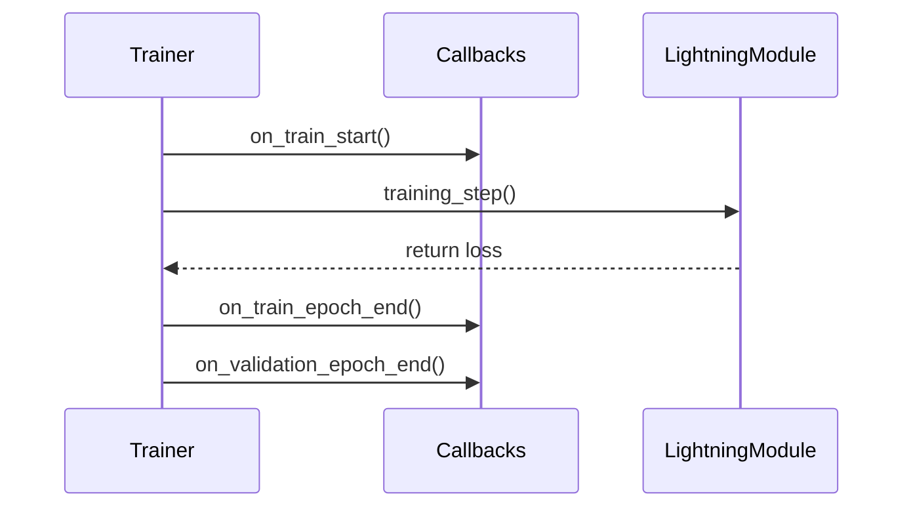

# 🛠️ PyTorch Lightning Callbacks

Callbacks are self-contained programs that hook into the PyTorch Lightning trainer lifecycle. They enable you to inject auxiliary code—such as early stopping, checkpointing, custom metrics, and visualization tools—without polluting your main `LightningModule` or model code. 

By keeping non-essential tasks out of the model training steps, Callbacks help you maintain clean, reusable, and easy-to-read model definitions.

---

## 📌 How Callbacks Work

While a `LightningModule` defines the core training steps (calculating loss, backpropagation, optimizers), a `Callback` monitors the execution process. It can hook into almost any step of the training, validation, or testing cycles:

### Key Event Hooks

Callbacks can override many methods, including:
* **`on_train_start(self, trainer, pl_module)`**: Runs when the training process begins.
* **`on_train_epoch_end(self, trainer, pl_module)`**: Runs immediately after a training epoch ends.
* **`on_validation_batch_end(self, trainer, pl_module, outputs, ...)`**: Accesses outputs from individual validation batches to collect prediction stats.
* **`on_validation_epoch_end(self, trainer, pl_module)`**: Computes cumulative validation epoch metrics and plots or logs reports.

---

## 📁 Callbacks in this Repository

Our callback classes are defined in `src/callbacks/`:

* **[callbacks.py](callbacks.py)**
  * **`LabelHistoryCallback`**: Prints the full chronological label history of a target user from the active dataset. This helps verify that sequence samplers and database loaders behave correctly.
* **[evaluation_callbacks.py](evaluation_callbacks.py)**
  * **`ConfusionMatrixCallback`**: Automatically computes a multiclass confusion matrix at the end of validation epochs and prints it to the console as a formatted `rich` library table.
  * **`ClassificationMetricsCallback`**: Uses `torchmetrics.MetricCollection` to calculate and log F1-score and AUROC metrics, updating their historical best values across epochs.
  * **`RegressionMetricsCallback`**: Computes regression metrics (MSE, MAE, $R^2$).
  * **`WithinPersonAUROCCallback`**: Evaluates within-participant ranking discrimination.
* **[prediction_collector.py](prediction_collector.py)**
  * **`PredictionCollectorCallback`**: Collects predictions, probabilities, and row indices during test passes.
* **[pooled_metrics_callback.py](pooled_metrics_callback.py)**
  * **`PooledMetricsCallback`**: Computes pooled out-of-fold metrics with user-cluster BCa bootstrap confidence intervals.

---

## 💡 Best Practices for Callbacks

> [!TIP]
> **Keep Models Agnostic**: Never make a `LightningModule` depend on a specific Callback's execution to function. Callbacks should strictly be "listeners" that read outputs, metrics, or states, rather than modifying model behavior during gradient steps.

> [!IMPORTANT]
> **Hydra Callbacks Configuration**: Callbacks are defined modularly inside `configs/callbacks/` as YAML files. You can choose which callbacks to run using command-line arguments (e.g., `callbacks=default`).
