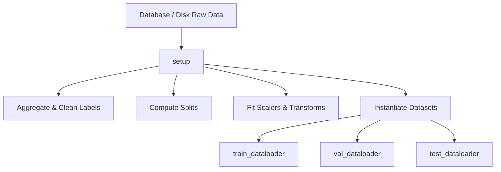

# 📊 PyTorch Lightning DataModules (`LightningDataModule`)

A `LightningDataModule` is a standardized class that encapsulates the complete data pipeline. It manages downloading/extracting data, cleaning, applying feature scaling, partitioning train/validation/test splits, and instantiating PyTorch `DataLoader` objects. This design ensures that your data processing is entirely separated from model training logic, making the pipeline highly reproducible.

---

## 📌 Why Use a DataModule?

In standard PyTorch, data loading code is often scattered across files, mixing database queries, splits, transforms, and loader parameters. 

A `LightningDataModule` unifies these phases into a single class with a predictable lifecycle:

### Key Lifetime Hooks

1. **`prepare_data(self)`**
   * Called only on a single process (CPU node 0) before any training starts.
   * Best for write-to-disk operations, downloading datasets, or downloading model checkpoints.
   * **Do not** assign state to the class here (`self.x = ...`), as this state will not be shared across multi-GPU/node systems.

2. **`setup(self, stage=None)`**
   * Called on every GPU/process individually.
   * Used to partition data (train, validation, and test splits), fit feature scalers on training data, apply transforms, and instantiate your PyTorch `Dataset` objects.

3. **`train_dataloader(self)`**
   * Returns a PyTorch `DataLoader` loaded with the training dataset (typically with `shuffle=True`).

4. **`val_dataloader(self)`**
   * Returns a PyTorch `DataLoader` loaded with the validation dataset (typically with `shuffle=False`).

5. **`test_dataloader(self)`**
   * Returns a PyTorch `DataLoader` loaded with the test dataset.

---

## 📁 DataModules in this Repository

The data processing pipelines are located in `src/data/`:

* **[health_datamodule.py](health_datamodule.py)**
  * Manages fetching longitudinal steps and sensor data, matching it to survey responses, and scaling inputs.
  * Supports three splitting modes (`split_mode`):
    * **`random`**: Row-level split (standard random shuffle).
    * **`user`**: Splits by user ID, ensuring disjoint participant populations (demographic generalizability).
    * **`longitudinal`**: Splits each user's history temporally (trains on the past, evaluates on the future).

---

## 💡 Best Practices for DataModules

> [!IMPORTANT]
> **Fit Scalers on Train Only**: To avoid data leakage, always fit your preprocessors and scalers (e.g., standard scalers) only on the training split, and then apply those fitted transformations to the validation and test splits.

> [!NOTE]
> **Use Hydra for Modular Configs**: In this project, DataModules are instantiated dynamically using Hydra config files in `configs/data/`. This makes it easy to change options like `batch_size`, `modalities` (steps, speed, proximity), or `split_mode` directly from the CLI.
