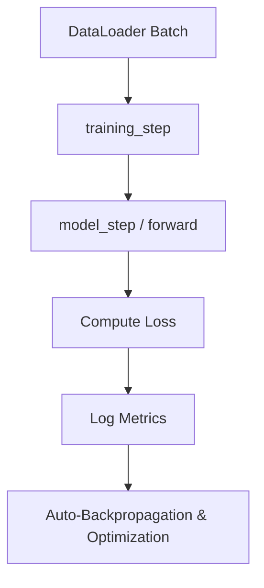

# 🧠 PyTorch Lightning Modules (`LightningModule`)

A `LightningModule` is the core structural unit of PyTorch Lightning. It organizes your raw PyTorch code into standard hooks, separating the neural network architecture from the training loop boilerplates. By encapsulating forward passes, training steps, validation steps, testing steps, and optimizers under one class, it ensures maximum reproducibility and modularity.

---

## 📌 How a `LightningModule` Works

In standard PyTorch, you write manual nested loops for iterating over epochs and batches, calling `optimizer.zero_grad()`, `loss.backward()`, and `optimizer.step()`. 

A `LightningModule` handles these loops automatically under the hood. You only need to define what happens at each step:

### Key Lifetime Hooks

Here are the primary hooks defined by the `LightningModule` interface:

1. **`__init__(self, ...)`**
   * Instantiate PyTorch neural network layers, loss functions, and evaluation metrics (e.g., from `torchmetrics`).
   * Use `self.save_hyperparameters()` to automatically store configuration values in the model checkpoint.

2. **`forward(self, x)`**
   * Defines the standard inference/prediction path.
   * This is where data is passed directly through the network layers.

3. **`setup(self, stage)`**
   * A hook executed before training starts (on every GPU process).
   * Used for runtime model compilation, dynamic shape adaptation, or initializing metrics that depend on dataset properties.

4. **`training_step(self, batch, batch_idx)`**
   * Processes a single training batch.
   * Performs forward passes, calculates training loss, and updates metric objects.
   * Returns the training loss tensor (crucial for PyTorch Lightning to execute backpropagation).

5. **`validation_step(self, batch, batch_idx)`**
   * Processes a validation batch to monitor performance and check for overfitting.
   * Logs validation loss and validation metrics (e.g., Accuracy, F1).
   * Often returns prediction dictionaries used by custom callbacks.

6. **`test_step(self, batch, batch_idx)`**
   * Run only when `trainer.test()` is explicitly called.
   * Evaluates the final, selected model checkpoint on unseen test data.

7. **`configure_optimizers(self)`**
   * Declares the optimizer(s) (e.g., Adam, AdamW, SGD) and learning rate scheduler(s).
   * Supports complex setups such as multiple optimizers (e.g., for GANs).

---

## 📁 Models in this Repository

Our model implementations are structured inside `src/models/`:

* **[health_module.py](health_module.py)**
  * Contains the modeling logic for participant longitudinal health tasks.
  * **`HealthLitModule`**: A sequence-based neural classifier (typically wrapping an LSTM) that trains via gradient descent.
  * **`FLAMLHealthModule`**: A wrapper for FLAML AutoML models (like XGBoost or LightGBM). Fits traditional tabular ML models in `setup()` and acts as a baseline.
  * **`BaselineHealthModule`**: Predicts simple baselines (like persisting the user's previous answer or predicting the training majority class).

---

## 💡 Best Practices for Writing Models

> [!TIP]
> **Keep Networks Separate**: Don't define the detailed neural network layers directly in the `LightningModule` class. Implement them as standard `torch.nn.Module` objects inside the `src/models/components/` subdirectory, and pass them as dependencies into the `LightningModule` constructor.

> [!IMPORTANT]
> **Use TorchMetrics**: Always use metric classes from the `torchmetrics` package for tracking metrics over epochs. They handle distributed synchronization across multiple GPUs automatically, avoiding common validation aggregation bugs.
